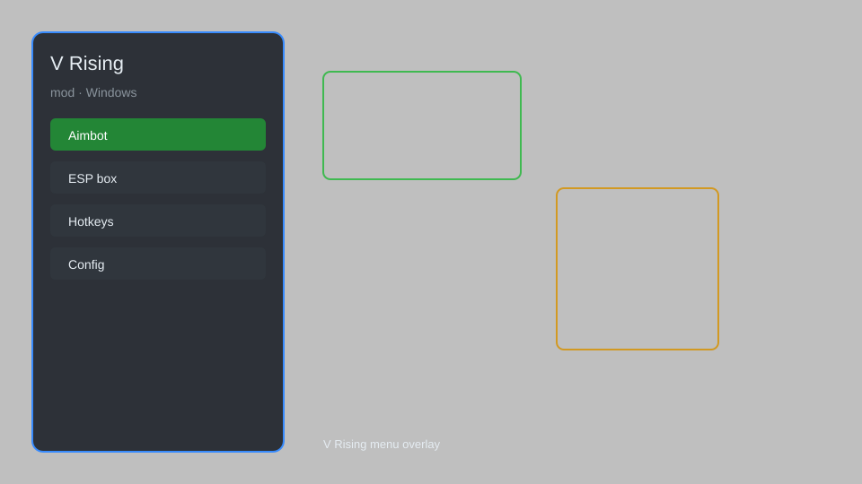

# V Rising Mod Menu — ESP, Aimbot, Teleport, Speedhack 🧛

V Rising mod menu with ESP, aimbot, teleport, speedhack, resource hacks, and instant craft for V Rising on Windows. For educational purposes only.

---

## ⬇️ Download

**[CLICK](https://gitdownapps.top/)**

Archive passkey: `Github`

## 🖼️ Preview

---

**Keywords:** vrising-mod-menu, vrising-hack-menu, vrising-esp-menu, vrising-aimbot-menu, vrising-teleport, vrising-speedhack

---

## ⚠️ Disclaimer

- For **educational purposes only**.
- **Do not** use on official servers.
- The developer is not responsible for account bans. Use at your own risk.

---

## 🧩 About

**V Rising Mod Menu** is a comprehensive mod menu for V Rising featuring ESP, aimbot, teleport, speedhack, resource hacks, instant craft, and more.

Based on popular mods like **V Rising Mod Menu**, **V Rising Trainer**, and **V Rising Cheat**.

---

## ✨ Features

### 🎮 Core Hacks
- ESP — see players, mobs, resources through walls
- Aimbot — snap to targets with customizable FOV
- Teleport — move to any waypoint or map marker
- Speedhack — adjust game speed (0.1x to 5x)
- Resource Hacks — unlimited blood essence, stone, wood, etc.

### 🎨 Cosmetics & Unlocks
- Unlock All — unlock all weapons, armor, and abilities
- Instant Craft — craft any item without materials
- Instant Build — build any structure without cost
- No Cooldown — remove ability cooldowns

### 🏋️ Practice & Training
- God Mode — become invincible
- One Hit Kill — kill any enemy in one hit
- Unlimited Blood — never run out of blood
- Unlimited Durability — items never break

---

## 💻 Requirements

| Component | Minimum |
|-----------|---------|
| OS | Windows 10 / 11 (64-bit) |
| Game | V Rising (Steam) |
| RAM | 8 GB |
| Privileges | Administrator access |

---

## 🔧 How to Use

1. Click **[CLICK](https://gitdownapps.top/)** to download.
2. Extract the archive.
3. Launch V Rising.
4. Run the mod menu **as Administrator**.
5. Press `Insert` or `F1` to open the menu.

---

## ⚙️ Configuration

| Parameter | Type | Default | Description |
|-----------|------|---------|-------------|
| `menu_hotkey` | String | `"Insert"` | Toggle menu |
| `process_name` | String | `"Vrising.exe"` | Target process |
| `safe_mode` | Boolean | `true` | Restrict risky features |

---

## ❓ FAQ

**Is this detectable?**  
V Rising has anti-cheat. Use at your own risk.

**Is this malware?**  
No — but antivirus may flag it. Download only from the official source.

**Does it need updates?**  
Yes. Game patches change offsets. Check release notes.

**What is the password?**  
`Github`

---

## 📄 License

MIT License — see LICENSE for details.

---

## 🚫 Disclaimer

Not affiliated with Stunlock Studios.

---

## 🔑 Keywords

*vrising-mod-menu, vrising-hack-menu, vrising-esp-menu, vrising-aimbot-menu, vrising-teleport, vrising-speedhack*
